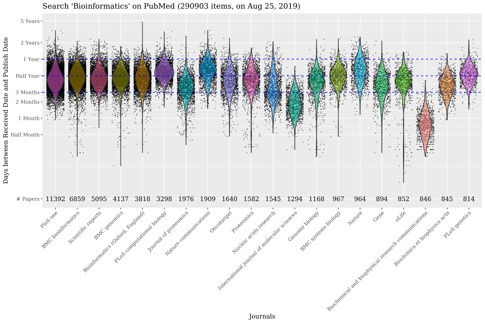

# Bioinformatics Papers on PubMed

## How-to Get the Data

`pubmed_result.csv`:

1. Open Pubmed: <https://www.ncbi.nlm.nih.gov/pubmed/>
2. Search: "bioinformatics"
3. "Send to" -> "File" -> "Format: CSV" -> "Sort by: Publication Date" -> "Create File"
4. "290903 items (on Aug 25, 2019)" downloaded

`pubmed_result.txt`:

1. Open Pubmed: <https://www.ncbi.nlm.nih.gov/pubmed/>
2. Search: "bioinformatics"
3. "Send to" -> "File" -> "Format: MEDLINE" -> "Sort by: Publication Date" -> "Create File"
4. "290903 items (on Aug 25, 2019)" downloaded

## Results

